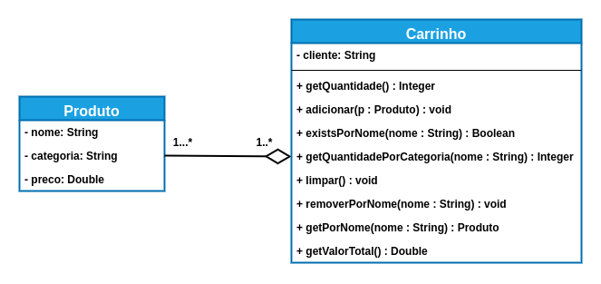

# Exercise - Relationships 📎

## General Guidelines: 🚨
1. **Respect** the attribute and method names defined in the exercise.
2. Be **careful** with the **arguments** specified in the exercise.
   **Do not** add unsolicited arguments and keep the order defined in the prompt.
3. Verify that there are **no compilation errors** in the project before submitting.
4. The classes must follow encapsulation rules.

## Cart 

Implement the following class diagram:

### Methods of the `Product` class:

* Must contain all properties (getters and setters).

### Methods of the `Cart` class:

- GetQuantity():
  * **Returns** the quantity of `Product`s included in the `Cart` (`int`).

- Add(product: Product):
  * Adds the received product to the product list.

- ExistsByName(name: string):
  * **Returns** whether a product exists inside the `Cart` by its name (`bool`).
  * Must ignore uppercase and lowercase letters (case-insensitive).

- GetQuantityByCategory(name: string):
  * **Returns** the quantity of products of a specific category (`int`).

- Clear():
  * Removes all products from the cart.
  
- RemoveByName(name: string):
  * Removes a product from inside the cart by its name.
  * Must ignore uppercase and lowercase letters (case-insensitive).

- GetByName(name: string):
  * **Returns** the product from the cart by its name (`Product`).
  * If the product is not found, return `null`.
  * Must ignore uppercase and lowercase letters (case-insensitive).

- GetTotalValue():
  * **Returns** the sum of the prices of all products (`double`).