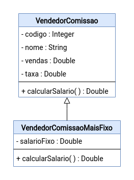

# Exercise - Inheritance 📎

## General Guidelines: 🚨
1. **Respect** the attribute and method names defined in the exercise.
2. Be **careful** with the **arguments** specified in the exercise.
   **Do not** add unsolicited arguments and keep the order defined in the prompt.
3. Verify that there are **no compilation errors** in the project before submitting.
4. The classes must follow encapsulation rules.

## Exercise - Seller 🚩

Implement the following class diagram:

**Note:** consider 0.05 = 5%, 0.1 = 10% for the rate value.

Methods of the `CommissionSeller` class:

* CalculateSalary:
  * calculates the seller's salary based on the **sales** and **rate** attributes.
  * **sales** is the total sold, and **rate** is the commission percentage applied to the sales.
  * **returns** `double`.

Methods of the `BasePlusCommissionSeller` class:

* CalculateSalary:
  * calculates the seller's salary based on the **sales**, **rate**, and **baseSalary** attributes.
  * **returns** `double`.