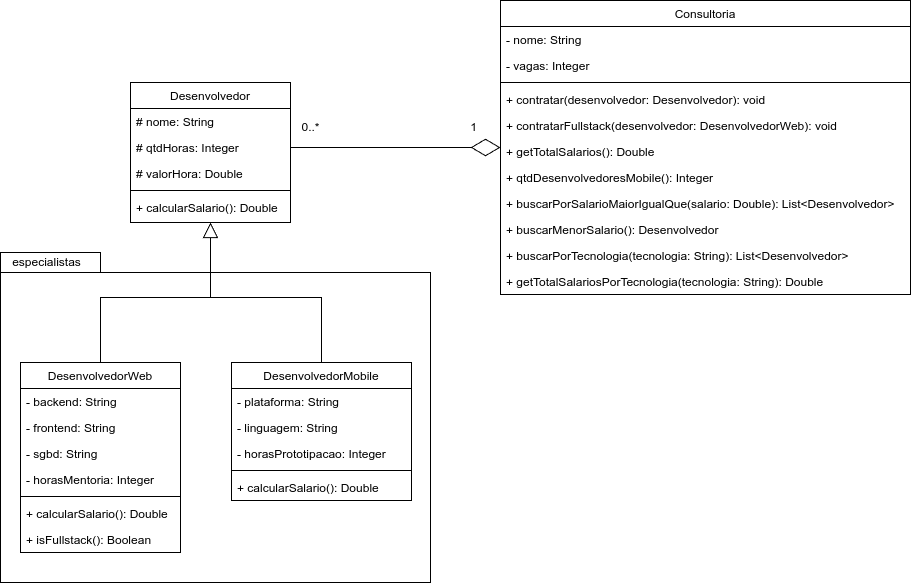

# Exercício - Herança com Agregação 📎

## Orientações Gerais 🚨

1. Utilize **apenas** tipos **wrapper** para criar atributos e métodos.
2. **Respeite** os nomes de atributos e métodos definidos no exercício.
3. Tome **cuidado** com os **argumentos** especificados no exercício.
4. **Não adicione** argumentos não solicitados e mantenha a ordem definida no enunciado.
4. Verifique se **não há erros de compilação** no projeto antes de enviar.
5. As classes devem seguir as regras de **encapsulamento**.

---

## Diagrama de classe

## Classe: `Desenvolvedor` 🚩

### Métodos Públicos

**Getters e Setters**
- Deve conter **todos** os métodos getters e setters.

**`public Double calcularSalario()`**
- **Descrição**: Calcula o salário do desenvolvedor com base nos atributos `qtdHoras` e `valorHora`.

---

## Classe: `DesenvolvedorWeb` 🖥️

### Métodos Públicos

**Getters e Setters**
- Deve conter **todos** os métodos getters e setters.

**`public Double calcularSalario()`**
- **Descrição**: Calcula o salário do desenvolvedor com base nos atributos `qtdHoras` e `valorHora`, adicionando as horas de mentoria, que valem **R$ 300,00** por hora.

**`public Boolean isFullstack()`**
- **Descrição**: Retorna `true` se o desenvolvedor for fullstack, ou seja, se os atributos `backend`, `frontend`, e `sgbd` forem diferentes de `null`.

---

## Classe: `DesenvolvedorMobile` 📱

### Métodos Públicos

**Getters e Setters**
- Deve conter **todos** os métodos getters e setters.

**`public Double calcularSalario()`**
- **Descrição**: Calcula o salário do desenvolvedor com base nos atributos `qtdHoras` e `valorHora`, adicionando as horas de prototipação, que valem **R$ 200,00** por hora.

---

## Classe: `Consultoria` 🏢

### Métodos Públicos

**Getters e Setters**
-  Deve conter **todos** os métodos getters e setters, **exceto** o da lista de desenvolvedores.

**`public void contratar(Desenvolvedor desenvolvedor)`**
-  **Descrição**: Adiciona o desenvolvedor à consultoria se houver vagas disponíveis.
- **Importante**: O atributo `vagas` representa um limite máximo (capacidade) de desenvolvedores e não deve ser decrementado ao contratar.

**`public void contratarFullstack(DesenvolvedorWeb desenvolvedor)`**
- **Descrição**: Adiciona o desenvolvedor fullstack à consultoria, validando se realmente é fullstack de acordo com as regras do método `isFullstack`.

**`public Double getTotalSalarios()`**
- **Descrição**: Retorna a soma de todos os salários dos desenvolvedores da consultoria.

**`public Integer qtdDesenvolvedoresMobile()`**
- **Descrição**: Retorna o total de desenvolvedores mobile da consultoria.

**`public List<Desenvolvedor> buscarPorSalarioMaiorIgualQue(Double salario)`**
- **Descrição**: Retorna todos os desenvolvedores com salário maior ou igual ao valor passado como argumento.

**`public Desenvolvedor buscarMenorSalario()`**
- **Descrição**: Retorna o desenvolvedor com o menor salário da consultoria.
- **Nota**: Caso a lista esteja vazia, retorna `null`.

---

### Desafio ⚡

**`public List<Desenvolvedor> buscarPorTecnologia(String tecnologia)`**
-  **Descrição**: Retorna os desenvolvedores que utilizam a tecnologia passada como argumento (pode ser `frontend`, `backend`, `sgbd`, `plataforma`, ou `linguagem`).

**`public Double getTotalSalariosPorTecnologia(String tecnologia)`**
- **Descrição**: Retorna a soma dos salários dos desenvolvedores que utilizam a tecnologia especificada.
